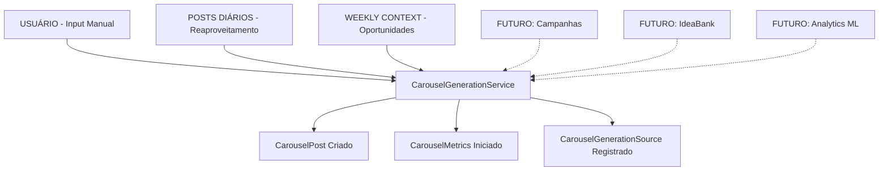

# 🎯 Origens de Conteúdo para Carrosséis

> **Estratégia:** MVP com 3 origens priorizadas por valor e facilidade  
> **Decisão:** Input Manual → Posts Diários → Weekly Context  
> **Status:** Planejamento e Especificação

---

## 📋 Índice

1. [Visão Geral](#visão-geral)
2. [Origem 1: Input Manual](#origem-1-input-manual)
3. [Origem 2: Posts Diários](#origem-2-posts-diários)
4. [Origem 3: Weekly Context](#origem-3-weekly-context)
5. [Origens Futuras](#origens-futuras)
6. [Arquitetura Unificada](#arquitetura-unificada)
7. [Priorização e Roadmap](#priorização-e-roadmap)

---

## 🎯 Visão Geral

### Múltiplas Fontes de Input

O sistema de carrosséis aceita conteúdo de múltiplas origens, cada uma com suas vantagens e casos de uso específicos.



### Decisão de Priorização (MVP)

| # | Origem | Prioridade | Razão | Sprint |
|---|--------|-----------|-------|--------|
| 1 | Input Manual | ⭐⭐⭐ Essencial | Base, flexibilidade total | Sprint 1 |
| 2 | Posts Diários | ⭐⭐⭐ Alto Valor | Reusa qualidade 98%, validado | Sprint 2 |
| 3 | Weekly Context | ⭐⭐ Valioso | Oportunidades, infra pronta | Sprint 3 |
| 4+ | Outras | 🔮 Futuro | Implementar após Fase 4 (ML) | N/A |

---

## 🥇 Origem 1: Input Manual

### Descrição

Usuário digita o tema diretamente na interface. Sistema gera carrossel do zero.

### Prioridade: ⭐⭐⭐ Essencial (MVP - Sprint 1)

**Por quê primeiro?**
- ✅ Funcionalidade core que não pode faltar
- ✅ Usuário tem controle total sobre tema
- ✅ Atende casos de uso urgentes e específicos
- ✅ Não depende de outros sistemas
- ✅ Interface simples

### Fluxo Técnico

```python
# Frontend: Formulário simples
user_input = {
    "theme": "5 dicas para aumentar seguidores no Instagram",
    "slide_count": 7,  # Opcional (padrão: 7)
}

# Backend: Endpoint
POST /api/v1/carousel/generate/
{
    "theme": "5 dicas para aumentar seguidores no Instagram",
    "options": {
        "slide_count": 7
    }
}

# Service
carousel = CarouselGenerationService().generate_from_manual_input(
    user=user,
    theme="5 dicas para aumentar seguidores no Instagram",
    options={'slide_count': 7}
)
```

### Interface (Frontend)

```typescript
// Componente: ManualCarouselForm.tsx

interface ManualCarouselFormProps {
  onGenerate: (theme: string, options: CarouselOptions) => Promise<void>;
}

export const ManualCarouselForm: React.FC<ManualCarouselFormProps> = ({ onGenerate }) => {
  return (
    <form onSubmit={handleSubmit}>
      <div>
        <label>Tema do Carrossel</label>
        <textarea 
          placeholder="Ex: 5 estratégias de copywriting para converter mais"
          rows={3}
        />
      </div>
      
      <div>
        <label>Número de Slides (opcional)</label>
        <input type="number" defaultValue={7} min={5} max={10} />
      </div>
      
      <button type="submit">
        Gerar Carrossel
      </button>
    </form>
  );
};
```

### Vantagens

| Vantagem | Descrição |
|----------|-----------|
| **Controle Total** | Usuário define exatamente o que quer |
| **Uso Imediato** | Não depende de conteúdo prévio |
| **Flexibilidade** | Qualquer tema, qualquer momento |
| **Urgência** | Atende necessidades urgentes |

### Casos de Uso

1. **Resposta a Comentário/DM**
   - Seguidor pergunta algo específico
   - Usuário cria carrossel respondendo
   
2. **Evento Repentino no Nicho**
   - Notícia relevante surgiu
   - Precisa criar conteúdo rápido
   
3. **Inspiração Momentânea**
   - Usuário teve uma ideia
   - Quer executar imediatamente
   
4. **Conteúdo Planejado Específico**
   - Já tinha tema definido
   - Não tem post ou oportunidade relacionada

### Exemplo Real

```
Contexto: Usuário viu comentário recorrente nas DMs
Comentário: "Como você edita suas fotos?"

Ação:
1. Abre PostNow
2. Clica "Novo Carrossel"
3. Digita: "5 apps que uso para editar fotos profissionais"
4. Clica "Gerar"

Resultado:
- Slide 1: Capa - "5 apps para editar fotos"
- Slides 2-6: Cada app explicado
- Slide 7: Recap + "Qual você já usa?"

Tempo: 3 minutos
```

---

## 🥈 Origem 2: Posts Diários

### Descrição

Transformar posts diários com bom desempenho em carrosséis expandidos. **Reusa análise semântica em 3 etapas (98% qualidade).**

### Prioridade: ⭐⭐⭐ Máximo Valor (MVP - Sprint 2)

**Por quê em segundo?**
- ✅ **Posts diários usam análise semântica em 3 etapas** (melhor qualidade do sistema)
- ✅ **Conteúdo já validado** pelo público (tem métricas de engajamento)
- ✅ **Aproveita momentum** de posts com bom desempenho
- ✅ **Reaproveitamento inteligente** - não desperdiça conteúdo bom
- ✅ **Economia de créditos** - análise semântica já foi feita
- ✅ **Infraestrutura pronta** - DailyIdeasService já existe

### Fluxo Técnico

```python
# Dashboard mostra posts diários com sugestão

# Frontend: Posts com botão "Expandir"
┌─────────────────────────────────────────┐
│ Posts Diários (Última Semana)           │
├─────────────────────────────────────────┤
│ ⭐ "5 erros que matam seu engajamento"  │
│    Engajamento: 8.5% | Salvamentos: 47 │
│    [Expandir para Carrossel] 🎠         │ ← NOVO
├─────────────────────────────────────────┤
│ ⭐ "Como triplicar alcance orgânico"    │
│    Engajamento: 7.2% | Salvamentos: 32 │
│    [Expandir para Carrossel] 🎠         │
└─────────────────────────────────────────┘

# Backend: Endpoint
POST /api/v1/carousel/expand-post/
{
    "post_id": 12345,
    "expand_strategy": "detailed_list"  # ou "auto"
}

# Service
carousel = CarouselGenerationService().generate_from_daily_post(
    user=user,
    post_id=12345,
    expand_strategy='detailed_list'
)
```

### Algoritmo de Sugestão Inteligente

```python
def suggest_posts_for_carousel_expansion(user: User) -> List[Dict]:
    """
    Identifica posts diários que devem virar carrossel.
    Retorna lista ordenada por score de viabilidade.
    """
    
    # Buscar posts dos últimos 30 dias
    recent_posts = Post.objects.filter(
        user=user,
        is_automatically_generated=True,
        created_at__gte=timezone.now() - timedelta(days=30)
    )
    
    candidates = []
    
    for post in recent_posts:
        score = 0
        reasons = []
        
        # 1. Engajamento acima da média? (+30 pontos)
        if post.engagement_rate > user.avg_engagement_rate * 1.2:
            score += 30
            reasons.append(f"Engajamento {post.engagement_rate}% (20% acima da média)")
        
        # 2. Muitos salvamentos? (+25 pontos)
        # Salvamentos = usuário quer revisar = conteúdo tem valor
        if post.saves_count > user.avg_saves * 1.5:
            score += 25
            reasons.append(f"{post.saves_count} salvamentos (50% acima da média)")
        
        # 3. Tipo de conteúdo "expandível"? (+20 pontos)
        expandable_patterns = [
            (r'\d+ (dicas|erros|estratégias|passos|formas)', 'Lista numerada'),
            (r'como (fazer|criar|aumentar)', 'Tutorial'),
            (r'antes (e|vs) depois', 'Transformação'),
            (r'(mitos|verdade) sobre', 'Mitos vs Verdades'),
        ]
        
        for pattern, label in expandable_patterns:
            if re.search(pattern, post.name.lower()):
                score += 20
                reasons.append(f"Formato expansível: {label}")
                break
        
        # 4. Já tem estrutura narrativa? (+15 pontos)
        if has_clear_structure(post.content):
            score += 15
            reasons.append("Estrutura narrativa clara")
        
        # 5. Comentários perguntando "mais detalhes"? (+10 pontos)
        if has_requests_for_more_info(post.comments):
            score += 10
            reasons.append("Público pediu mais detalhes")
        
        # Score mínimo: 50 pontos para sugerir
        if score >= 50:
            candidates.append({
                'post': post,
                'score': score,
                'reasons': reasons,
                'suggested_narrative': infer_narrative_type(post),
                'estimated_slides': estimate_slide_count(post)
            })
    
    # Ordenar por score (maior primeiro)
    return sorted(candidates, key=lambda x: x['score'], reverse=True)


# Exemplo de resultado:
suggestions = [
    {
        'post': Post(id=12345, name="5 erros que matam engajamento"),
        'score': 85,
        'reasons': [
            'Engajamento 8.5% (106% acima da média)',
            '47 salvamentos (88% acima da média)',
            'Formato expansível: Lista numerada',
            'Estrutura narrativa clara'
        ],
        'suggested_narrative': 'detailed_list',
        'estimated_slides': 7
    },
    {
        'post': Post(id=12346, name="Como triplicar alcance orgânico"),
        'score': 70,
        'reasons': [
            'Engajamento 7.2% (85% acima da média)',
            'Formato expansível: Tutorial',
            'Público pediu mais detalhes'
        ],
        'suggested_narrative': 'tutorial',
        'estimated_slides': 8
    }
]
```

### Estratégias de Expansão

#### A. Detailed List (Lista → Carrossel Detalhado)

```
Post Original: "5 estratégias de copywriting para converter"
└─ Análise: Já é uma lista, expandir cada ponto

Carrossel (7 slides):
  Slide 1: Capa - "5 estratégias de copywriting"
           "Deslize para ver todas →"
  
  Slide 2: Estratégia #1 - "Use gatilhos mentais"
           + Exemplo prático
           + Micro-dica
  
  Slide 3: Estratégia #2 - "Crie senso de urgência"
           + Exemplo prático
           + Micro-dica
  
  ... (slides 4-6 seguem padrão)
  
  Slide 7: Recapitulação
           "Qual você vai testar primeiro?"
           Logo + CTA
```

#### B. Tutorial (Conceito → Passo-a-Passo)

```
Post Original: "Como criar hooks irresistíveis"
└─ Análise: É um "como fazer", transformar em tutorial

Carrossel (8 slides):
  Slide 1: Capa - "Como criar hooks em 6 passos"
  
  Slides 2-7: Cada passo detalhado
    - Passo 1: Identifique a dor
    - Passo 2: Prometa solução
    - Passo 3: Crie curiosidade
    - ...
  
  Slide 8: Template pronto + CTA
           "Salve para usar depois!"
```

#### C. Before/After (Resultado → Jornada)

```
Post Original: "Como saí de 500 para 10k seguidores"
└─ Análise: É uma transformação, mostrar jornada

Carrossel (7 slides):
  Slide 1: "De 500 para 10k em 90 dias"
  
  Slides 2-3: Situação ANTES
    - O que estava fazendo errado
    - Frustração e dificuldades
  
  Slides 4-5: O que MUDEI
    - Estratégia 1: Reels diários
    - Estratégia 2: Engajamento ativo
  
  Slide 6: Situação DEPOIS
    - Resultados numéricos
    - Lições aprendidas
  
  Slide 7: Como VOCÊ pode replicar
           Checklist + CTA
```

### Vantagens Técnicas

```python
# Reaproveitamento da Melhor Qualidade

class CarouselFromDailyPostService:
    
    def expand_post_to_carousel(self, post_id):
        
        # 1. Pegar post diário (qualidade 98%)
        post = Post.objects.get(id=post_id)
        
        # 2. REUSAR análise semântica do post original
        # ⚠️ NÃO REFAZ - Economia de créditos!
        semantic_analysis = self._extract_semantic_from_post(post)
        
        # 3. Identificar estrutura
        structure = self._analyze_post_structure(post.content)
        # Ex: Detecta que é lista de 5 itens
        
        # 4. Gerar slides expandidos
        # Cada item da lista vira 1 slide
        slides = self._expand_structure_to_slides(
            structure, 
            semantic_analysis  # Reaproveitamento!
        )
        
        # 5. Imagens mantêm MESMA QUALIDADE
        # Usa mesmo fluxo: DailyIdeasService._generate_image_for_feed_post()
        for slide in slides:
            image = self._generate_image_with_semantic_analysis(
                slide, 
                semantic_analysis  # Reusa análise!
            )
            slide.image_url = image
        
        return carousel
```

### Interface (Frontend)

```typescript
// Componente: DailyPostsWithCarouselSuggestion.tsx

interface PostWithSuggestion {
  post: Post;
  score: number;
  reasons: string[];
  suggestedNarrative: string;
}

export const DailyPostsGrid: React.FC = () => {
  const { data: suggestions } = useQuery<PostWithSuggestion[]>(
    'carousel-suggestions',
    fetchCarouselSuggestions
  );
  
  return (
    <div>
      <h2>Posts com Alto Potencial de Carrossel</h2>
      {suggestions?.map(suggestion => (
        <PostCard key={suggestion.post.id}>
          <PostContent post={suggestion.post} />
          
          <MetricsBar>
            <Metric label="Engajamento" value={`${suggestion.post.engagement_rate}%`} />
            <Metric label="Salvamentos" value={suggestion.post.saves} />
          </MetricsBar>
          
          {suggestion.score >= 70 && (
            <SuggestionBadge variant="high">
              ⭐ Alto potencial de carrossel
            </SuggestionBadge>
          )}
          
          <ExpandButton 
            postId={suggestion.post.id}
            strategy={suggestion.suggestedNarrative}
          >
            🎠 Expandir para Carrossel
          </ExpandButton>
          
          <ReasonsList>
            {suggestion.reasons.map(reason => (
              <ReasonItem key={reason}>{reason}</ReasonItem>
            ))}
          </ReasonsList>
        </PostCard>
      ))}
    </div>
  );
};
```

### Vantagens

| Vantagem | Descrição | Impacto |
|----------|-----------|---------|
| **Qualidade 98%** | Reusa melhor sistema da plataforma | ⭐⭐⭐ |
| **Conteúdo Validado** | Post já tem métricas de engajamento | ⭐⭐⭐ |
| **Economia de Créditos** | Análise semântica já foi feita | ⭐⭐ |
| **Aproveita Momentum** | Conteúdo já viralizou, expandir para mais | ⭐⭐⭐ |
| **Zero Desperdício** | Não perde conteúdo de alto valor | ⭐⭐ |
| **Infraestrutura Pronta** | Reusa código existente | ⭐⭐ |

### Casos de Uso

1. **Post Viral**
   - Post teve 3× mais engajamento que média
   - Expandir para carrossel para aprofundar
   
2. **Muito Salvamentos**
   - Post tem muitos salvamentos
   - Indica que conteúdo tem valor revisitável
   - Carrossel é formato ideal para conteúdo "de referência"
   
3. **Pedidos nos Comentários**
   - Comentários: "Pode explicar melhor o ponto 3?"
   - Expandir para carrossel detalhado
   
4. **Reaproveitamento Estratégico**
   - Post de 2 semanas atrás performou bem
   - Republica como carrossel expandido

### Exemplo Real

```
Contexto: Post diário de 1 semana atrás

Post Original:
"5 erros que matam seu engajamento no Instagram"
- Erro 1: Postar em horário ruim
- Erro 2: Ignorar comentários
- Erro 3: Legendas genéricas
- Erro 4: Não usar Reels
- Erro 5: Perfil desorganizado

Métricas:
- Engajamento: 8.5% (média do usuário: 4.1%)
- Salvamentos: 47 (média: 12)
- Comentários: "Pode explicar melhor cada erro?"

Sistema Sugere:
"Este post tem alto potencial! Expandir para carrossel?"
Score: 85/100

Usuário Clica: "Expandir para Carrossel"

Resultado Automático:
- Slide 1: Capa - "5 erros que matam engajamento"
- Slides 2-6: Cada erro explicado em detalhes
- Slide 7: Recap + Checklist para salvar

Qualidade: 98% (mesma do post original)
Tempo: 2 minutos (automático)
Créditos: Economiza 50% (reusa análise)
```

---

## 🥉 Origem 3: Weekly Context

### Descrição

Criar carrossél baseado em oportunidades detectadas pelo Weekly Context (datas comemorativas, tendências, eventos).

### Prioridade: ⭐⭐ Valioso (MVP - Sprint 3)

**Por quê em terceiro?**
- ✅ Infraestrutura já existe (`WeeklyContextService`)
- ✅ Conteúdo relevante e oportuno
- ✅ Integração simples (código praticamente pronto)
- ⚠️ Requer planejamento (não é uso imediato)
- ⚠️ Sazonal (nem sempre tem oportunidade relevante)

**Continua no MVP porque:**
- Código praticamente pronto
- Valor alto (datas comemorativas = alto engajamento)
- Complementa bem as outras duas origens

### Fluxo Técnico

```python
# Sistema detecta oportunidades semanalmente

# Frontend: Dashboard com oportunidades
┌────────────────────────────────────────────┐
│ Oportunidades desta Semana                 │
├────────────────────────────────────────────┤
│ 📅 Dia das Mães (em 21 dias)              │
│    Relevância: 95% para seu nicho          │
│    Sugestões:                              │
│    - Presentes que toda mãe ama            │
│    - Como homenagear sua mãe               │
│    [Criar Carrossel] 🎠                    │
├────────────────────────────────────────────┤
│ 🔥 Black Friday (em 30 dias)              │
│    Relevância: 98% para seu nicho          │
│    [Criar Carrossel] 🎠                    │
└────────────────────────────────────────────┘

# Backend: Endpoint
POST /api/v1/carousel/from-opportunity/
{
    "opportunity_id": "dia-das-maes-2025",
    "angle": "7 presentes que toda mãe ama"
}

# Service
carousel = CarouselGenerationService().generate_from_opportunity(
    user=user,
    opportunity_id='dia-das-maes-2025',
    angle='7 presentes que toda mãe ama'
)
```

### Dados Disponíveis (WeeklyContextService)

```python
# Exemplo de oportunidade
opportunity = {
    'id': 'dia-das-maes-2025',
    'title': 'Dia das Mães',
    'date': '2025-05-12',
    'category': 'commercial',
    'keywords': ['mãe', 'família', 'presente', 'homenagem'],
    'relevance_score': 95,  # 0-100 baseado no nicho do usuário
    'advance_days': 21,  # Avisar 21 dias antes
    'ideal_for': ['ecommerce', 'presentes', 'beleza'],
    'suggested_angles': [
        '7 presentes que toda mãe ama',
        'Como homenagear sua mãe de forma especial',
        'História de mães empreendedoras inspiradoras'
    ],
    'expected_engagement': '+42% vs. média',
    'best_posting_window': '2025-04-21 a 2025-05-11'
}
```

### Integração com Sistema Existente

```python
# WeeklyContextService já implementado!

class WeeklyContextService:
    """Sistema já existente de oportunidades."""
    
    def get_opportunities_for_user(self, user, niche=None, limit=5):
        """
        Retorna oportunidades relevantes para o usuário.
        JÁ IMPLEMENTADO!
        """
        opportunities = []
        
        # Buscar no calendário brasileiro
        for day_month, data in self.BRAZILIAN_CALENDAR.items():
            # Calcular relevância para o nicho
            relevance = self._calculate_relevance(data, user.niche)
            
            if relevance >= 70:  # Threshold
                opportunities.append({
                    'id': f"{day_month}-{data['title']}",
                    'title': data['title'],
                    'category': data['category'],
                    'keywords': data['keywords'],
                    'relevance_score': relevance,
                    'advance_days': data['advance_days']
                })
        
        return sorted(opportunities, key=lambda x: x['relevance_score'], reverse=True)
```

### Interface (Frontend)

```typescript
// Componente: WeeklyOpportunities.tsx

interface Opportunity {
  id: string;
  title: string;
  date: string;
  relevance_score: number;
  suggested_angles: string[];
}

export const WeeklyOpportunitiesPanel: React.FC = () => {
  const { data: opportunities } = useQuery<Opportunity[]>(
    'weekly-opportunities',
    fetchWeeklyOpportunities
  );
  
  return (
    <div>
      <h2>📅 Oportunidades Planejadas</h2>
      <p>Datas e tendências relevantes para seu nicho</p>
      
      {opportunities?.map(opp => (
        <OpportunityCard key={opp.id}>
          <Header>
            <Title>{opp.title}</Title>
            <RelevanceBadge score={opp.relevance_score}>
              {opp.relevance_score}% relevante
            </RelevanceBadge>
          </Header>
          
          <Date>{formatDate(opp.date)} - {daysUntil(opp.date)} dias</Date>
          
          <SuggestedAngles>
            <h4>Sugestões de Ângulo:</h4>
            {opp.suggested_angles.map(angle => (
              <AngleButton
                key={angle}
                onClick={() => handleCreateCarousel(opp.id, angle)}
              >
                {angle}
                <Icon name="arrow-right" />
              </AngleButton>
            ))}
          </SuggestedAngles>
          
          <CreateButton onClick={() => handleCreateCarousel(opp.id)}>
            🎠 Criar Carrossel para esta Data
          </CreateButton>
        </OpportunityCard>
      ))}
    </div>
  );
};
```

### Vantagens

| Vantagem | Descrição |
|----------|-----------|
| **Conteúdo Oportuno** | Datas e eventos relevantes |
| **Planejamento Antecipado** | Avisos com 14-30 dias de antecedência |
| **Alto Engajamento** | Conteúdo sazonal performa bem |
| **Infraestrutura Pronta** | Sistema já existe |
| **Relevância Calculada** | Filtra por nicho do usuário |

### Casos de Uso

1. **Datas Comemorativas**
   - Dia das Mães, Dia dos Pais, Natal
   - Sistema alerta com antecedência
   - Usuário cria carrossel planejado
   
2. **Eventos do Setor**
   - Black Friday, Cyber Monday
   - Conferências e feiras
   - Lançamentos importantes
   
3. **Tendências Detectadas**
   - Assunto em alta no nicho
   - Notícia relevante
   - Mudança de algoritmo
   
4. **Sazonalidade**
   - Volta às aulas
   - Verão/Inverno
   - Início de ano

### Exemplo Real

```
Contexto: Sistema analisa calendário semanalmente

Sistema Detecta:
"Dia das Mães em 21 dias"
Relevância: 95% (nicho: ecommerce presentes)

Notificação para Usuário:
┌──────────────────────────────────────┐
│ 🔔 Nova Oportunidade Detectada!      │
│                                      │
│ 📅 Dia das Mães (12 de maio)        │
│ Relevância: 95% para seu negócio    │
│                                      │
│ Sugestões de Carrossel:              │
│ 1. "7 presentes que toda mãe ama"   │
│ 2. "Como escolher presente perfeito" │
│ 3. "Mães empreendedoras inspiram"    │
│                                      │
│ [Criar Carrossel Agora] 🎠          │
└──────────────────────────────────────┘

Usuário Escolhe: Opção 1

Sistema Gera Automaticamente:
- Tema: "7 presentes que toda mãe ama - Guia para Dia das Mães"
- Contexto: Palavras-chave da oportunidade
- Slides: 7 (1 capa + 5 presentes + 1 CTA)
- Qualidade: Análise semântica completa
- Logo: Primeiro e último slide

Resultado:
- Carrossel pronto para revisar
- Planejado para publicar 7 dias antes
- Esperado: +42% engagement vs. média
```

---

## 🔮 Origens Futuras

Estas origens **não serão implementadas no MVP**. Serão consideradas após **Fase 4 (ML)**, quando tivermos dados para validar sua necessidade.

### 4. Campanhas Existentes

**Descrição:** Adicionar carrossel como parte de campanha em andamento.

```python
# Futuro (não MVP)
POST /api/v1/carousel/generate-for-campaign/
{
    "campaign_id": 789,
    "insert_position": 4,
    "carousel_purpose": "explain_product_features"
}
```

**Por quê não no MVP:**
- Requer integração com sistema de campanhas
- Caso de uso mais específico
- Menos urgente que as 3 origens principais

---

### 5. IdeaBank (Ideias Salvas)

**Descrição:** Reutilizar ideias de posts salvos mas não publicados.

```python
# Futuro (não MVP)
POST /api/v1/carousel/generate-from-idea/
{
    "idea_id": 456
}
```

**Por quê não no MVP:**
- Funcionalidade "nice to have"
- Usuários podem usar Input Manual para mesmo resultado
- Menos valor que outras origens

---

### 6. Analytics e Sugestões ML (Fase 4)

**Descrição:** IA detecta padrões e sugere carrosséis automaticamente.

```python
# Fase 4 (após coleta de dados)
suggestions = CarouselMLService().generate_smart_suggestions(user)

# Exemplo de sugestão:
{
    "theme": "5 técnicas de storytelling que triplicam engajamento",
    "reason": "Baseado em análise de 30 dias de dados",
    "expected_engagement": "7.2% (vs. média 4.1%)",
    "confidence": 0.87,
    "best_origin": "expand_post",  # ML decide!
    "best_timing": "terça, 19h"
}
```

**Por quê Fase 4:**
- Requer dados reais de uso
- Precisa de modelo de ML treinado
- Implementação data-driven (não achismo)

---

### 7. Calendário de Conteúdo

**Descrição:** Planejamento antecipado de carrosséis com geração automática.

```python
# Futuro
content_calendar = {
    "2025-05-05": {
        "type": "carousel",
        "theme": "Dicas pré-Dia das Mães",
        "auto_generate": True,
        "auto_publish": False
    }
}
```

**Por quê não no MVP:**
- Funcionalidade avançada
- Requer sistema de agendamento
- Pode ser simulado com Weekly Context

---

## 🏗️ Arquitetura Unificada

### Modelo de Rastreamento

Todos os carrosséis registram sua origem para análise posterior (Fase 4).

```python
# IdeaBank/models.py

class CarouselGenerationSource(models.Model):
    """
    Rastreia origem da geração do carrossel.
    CRÍTICO para análise de dados na Fase 4.
    """
    
    carousel = models.OneToOneField(
        CarouselPost,
        on_delete=models.CASCADE,
        related_name='generation_source'
    )
    
    # Tipo de origem (MVP: 3 tipos implementados)
    source_type = models.CharField(
        max_length=50,
        choices=[
            ('manual', 'Input Manual do Usuário'),  # MVP
            ('from_post', 'Expandido de Post Existente'),  # MVP
            ('weekly_context', 'Weekly Context/Oportunidade'),  # MVP
            ('from_campaign', 'Parte de Campanha'),  # Futuro
            ('from_idea', 'Do IdeaBank'),  # Futuro
            ('from_analytics', 'Sugestão baseada em Analytics'),  # Fase 4
            ('from_calendar', 'Calendário de Conteúdo'),  # Futuro
        ]
    )
    
    # Referências (opcional, depende do tipo)
    source_post_id = models.IntegerField(null=True, blank=True)
    source_campaign_id = models.IntegerField(null=True, blank=True)
    source_opportunity_id = models.CharField(max_length=100, blank=True)
    
    # Metadata
    original_theme = models.TextField()
    user_modifications = models.JSONField(default=dict)
    
    created_at = models.DateTimeField(auto_now_add=True)
```

### Service Unificado

```python
# IdeaBank/services/carousel_generation_service.py

class CarouselGenerationService:
    """
    Service unificado para todas as origens.
    MVP implementa apenas 3 métodos principais.
    """
    
    # ===== MVP - IMPLEMENTAR =====
    
    def generate_from_manual_input(self, user, theme, options):
        """Origem 1: Input manual (Sprint 1)"""
        pass
    
    def generate_from_daily_post(self, user, post_id, expand_strategy):
        """Origem 2: Posts diários (Sprint 2)"""
        pass
    
    def generate_from_opportunity(self, user, opportunity_id, angle):
        """Origem 3: Weekly context (Sprint 3)"""
        pass
    
    # ===== FUTURO - NÃO IMPLEMENTAR NO MVP =====
    
    def generate_for_campaign(self, user, campaign_id, purpose):
        """Origem 4: Campanha (futuro)"""
        raise NotImplementedError("Feature não disponível no MVP")
    
    def generate_from_idea(self, user, idea_id):
        """Origem 5: IdeaBank (futuro)"""
        raise NotImplementedError("Feature não disponível no MVP")
    
    def generate_from_analytics_suggestion(self, user, suggestion_id):
        """Origem 6: Analytics (Fase 4)"""
        raise NotImplementedError("Feature disponível após Fase 4")
    
    def generate_from_calendar(self, user, calendar_event_id):
        """Origem 7: Calendário (futuro)"""
        raise NotImplementedError("Feature não disponível no MVP")
```

---

## 🎯 Priorização e Roadmap

### MVP (Fase 1) - 3 Sprints

| Sprint | Origem | Objetivo | Endpoints |
|--------|--------|----------|-----------|
| **Sprint 1** | Input Manual | Funcionalidade base | `POST /api/v1/carousel/generate/` |
| **Sprint 2** | Posts Diários | Reaproveitamento inteligente | `POST /api/v1/carousel/expand-post/`<br>`GET /api/v1/carousel/suggestions/` |
| **Sprint 3** | Weekly Context | Oportunidades planejadas | `POST /api/v1/carousel/from-opportunity/`<br>`GET /api/v1/opportunities/` |

### Período de Coleta (1-2 meses)

**Objetivo:** Coletar dados de uso real antes de implementar novas features.

**Análises:**
- Qual origem performa melhor?
- Usuários preferem qual origem?
- Qual gera mais engajamento?
- Padrões de uso identificados

### Fase 4 (3-4 sprints)

**Baseado em Dados Reais:**
- Implementar ML para sugestões automáticas
- Decidir se vale implementar origens 4-7
- Otimizar origens MVP baseado em dados

---

## 📊 Métricas de Sucesso (Por Origem)

### Como Avaliar Cada Origem

```python
# Análise comparativa após 1-2 meses

origin_comparison = {
    'manual': {
        'total_generated': 120,
        'avg_engagement': 2.1%,
        'completion_rate': 45%,
        'user_satisfaction': 7.5/10
    },
    'from_post': {
        'total_generated': 85,
        'avg_engagement': 6.2%,  # ⭐ MELHOR!
        'completion_rate': 58%,  # ⭐ MELHOR!
        'user_satisfaction': 9.1/10
    },
    'weekly_context': {
        'total_generated': 45,
        'avg_engagement': 3.8%,
        'completion_rate': 52%,
        'user_satisfaction': 8.2/10
    }
}

# Decisões baseadas em dados:
decisions = {
    'priorize': 'from_post',  # Melhor performance
    'mantain': 'weekly_context',  # Bom para planejamento
    'improve': 'manual',  # Precisa de otimização
}
```

---

## ✅ Checklist de Implementação

### Sprint 1: Input Manual
- [ ] Endpoint `POST /api/v1/carousel/generate/`
- [ ] Service: `generate_from_manual_input()`
- [ ] Frontend: Formulário simples
- [ ] Testes: Input manual básico
- [ ] Logging: Rastreamento de origem

### Sprint 2: Posts Diários
- [ ] Endpoint `POST /api/v1/carousel/expand-post/`
- [ ] Endpoint `GET /api/v1/carousel/suggestions/`
- [ ] Service: `generate_from_daily_post()`
- [ ] Algoritmo: Detecção de posts expansíveis
- [ ] Frontend: Botão "Expandir" em posts
- [ ] Frontend: Lista de sugestões
- [ ] Testes: Expansão de lista, tutorial, before/after

### Sprint 3: Weekly Context
- [ ] Endpoint `POST /api/v1/carousel/from-opportunity/`
- [ ] Endpoint `GET /api/v1/opportunities/`
- [ ] Service: `generate_from_opportunity()`
- [ ] Integração: `WeeklyContextService`
- [ ] Frontend: Painel de oportunidades
- [ ] Frontend: Seleção de ângulo
- [ ] Testes: Geração a partir de oportunidade

---

**Próximo Documento:** `CAROUSEL_IMPLEMENTATION_GUIDE.md` (arquitetura detalhada)  
**Documento Relacionado:** `CAROUSEL_PROMPTS.md` (prompts por origem)

---

_Documento criado em: Janeiro 2025_  
_Status: 📋 Planejamento_  
_Responsável: Equipe PostNow_

