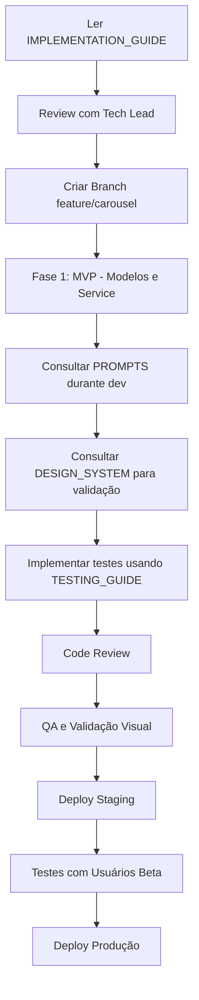

# 📚 Índice: Documentação de Carrosséis Instagram

> **Status do Projeto:** Planejamento e Especificação Completa  
> **Data:** Janeiro 2025  
> **Equipe:** PostNow Development Team

---

## 🎯 Visão Geral

Este conjunto de documentos contém **tudo o que você precisa** para implementar o sistema de geração automática de carrosséis para Instagram na plataforma PostNow.

### O que são Carrosséis?

Posts do Instagram que contêm múltiplas imagens (2-10 slides) que os usuários podem deslizar para ver. São o formato com **maior engajamento** na plataforma (2.33% vs. 1.74% de posts únicos).

---

## 📄 Documentos (Ordem de Leitura)

### 1️⃣ **CAROUSEL_IMPLEMENTATION_GUIDE.md** ⭐ COMECE AQUI

**O QUE É:** Documento principal com visão completa do projeto

**CONTÉM:**
- ✅ Contexto e decisões estratégicas
- ✅ Pesquisa de mercado e fundamentos
- ✅ Especificações técnicas (dimensões, formatos, etc.)
- ✅ Arquitetura proposta (modelos, services)
- ✅ Sistema base para reutilizar (DailyIdeasService)
- ✅ Roadmap de implementação (4 fases)
- ✅ Métricas e KPIs
- ✅ Histórico de decisões

**PÚBLICO:** Tech Leads, Product Managers, Desenvolvedores

**TEMPO DE LEITURA:** 30-40 minutos

**QUANDO LER:** Antes de começar qualquer implementação

---

### 2️⃣ **CAROUSEL_PROMPTS.md**

**O QUE É:** Biblioteca completa de prompts de IA

**CONTÉM:**
- ✅ Prompts de estruturação de narrativa
- ✅ Prompts por tipo (tutorial, lista, storytelling, etc.)
- ✅ Prompts de geração de texto
- ✅ Prompts de geração de imagem
- ✅ Prompts de análise de consistência
- ✅ Prompts de validação de qualidade
- ✅ Exemplos de uso completo

**PÚBLICO:** Desenvolvedores Backend, AI Engineers

**TEMPO DE LEITURA:** 20-30 minutos

**QUANDO LER:** Durante implementação do CarouselGenerationService

---

### 3️⃣ **CAROUSEL_DESIGN_SYSTEM.md**

**O QUE É:** Guia visual e padrões de design

**CONTÉM:**
- ✅ Fundamentos visuais (dimensões, hierarquia)
- ✅ Sistema de grid e layouts
- ✅ Tipografia e escalas
- ✅ Paletas de cores e estratégias
- ✅ Elementos de interface (setas, numeração, etc.)
- ✅ Templates por tipo de narrativa
- ✅ Tratamento de logo
- ✅ Exemplos práticos visuais

**PÚBLICO:** Designers, Desenvolvedores Frontend, Product

**TEMPO DE LEITURA:** 25-35 minutos

**QUANDO LER:** Ao criar templates e validar qualidade visual

---

### 4️⃣ **CAROUSEL_TESTING_GUIDE.md**

**O QUE É:** Casos de teste e validação

**CONTÉM:**
- ✅ Casos de teste unitários
- ✅ Casos de teste de integração
- ✅ Métricas de qualidade
- ✅ Checklist de validação pré-publicação
- ✅ Benchmarks por tipo de narrativa

**PÚBLICO:** QA Engineers, Desenvolvedores

**TEMPO DE LEITURA:** 15-20 minutos

**QUANDO LER:** Durante desenvolvimento de testes automatizados

---

## 🗺️ Fluxo de Implementação Recomendado



---

## 🎯 Decisões Chave Documentadas

| Decisão | Documento | Página/Seção |
|---------|-----------|--------------|
| Por que carrosséis? | IMPLEMENTATION_GUIDE | Contexto e Decisão |
| Usar DailyIdeasService como base | IMPLEMENTATION_GUIDE | Sistema Base |
| 6-8 slides como padrão | IMPLEMENTATION_GUIDE | Especificações Técnicas |
| Logo em primeiro + último | DESIGN_SYSTEM | Tratamento de Logo |
| Análise semântica em 3 etapas | PROMPTS | Prompts de Estruturação |
| Proporção 4:5 (vertical) | DESIGN_SYSTEM | Fundamentos Visuais |
| Tipos de narrativa suportados | PROMPTS | Prompts por Tipo |

---

## 📊 Dados e Pesquisa

### Benchmarks de Mercado

```yaml
Engajamento:
  carrossel: 2.33%
  post_unico: 1.74%
  diferenca: +34% a favor de carrosséis

Completion Rate por Slides:
  2_5_slides: 70-80%
  6_8_slides: 50-60%  # Sweet spot
  9_10_slides: 30-40%

Tipos com Melhor Performance:
  1. Quiz/Teste: 90%
  2. Tutorial: 85%
  3. Mitos vs. Verdades: 80%
  4. Antes e Depois: 75%
  5. Lista/Checklist: 70%
```

### Especificações Instagram

```yaml
Formato:
  proporcao_ideal: "4:5 (vertical)"
  pixels: "1080x1350"
  slides: "2-10 (ideal: 6-8)"
  tamanho_max: "30MB por imagem"

API:
  endpoint: "/ig-media"
  tipo: "CAROUSEL_ALBUM"
  limite_rate: "200 requests/hora"
```

---

## 🏗️ Arquitetura Técnica

### Novos Componentes

```python
# Backend Django
IdeaBank/models.py:
  - CarouselPost (novo)
  - CarouselSlide (novo)

IdeaBank/services/:
  - carousel_generation_service.py (novo)
  
IdeaBank/serializers.py:
  - CarouselPostSerializer (novo)
  - CarouselSlideSerializer (novo)

api/v1/carousel/:
  - urls.py (novo)
  - views.py (novo)
```

### Componentes Reusados

```python
# Infraestrutura Existente (NÃO recriar!)
IdeaBank/services/daily_ideas_service.py:
  - _generate_image_for_feed_post()  # Análise semântica

services/ai_service.py:
  - generate_text()
  - generate_image()

services/s3_service.py:
  - upload_image()

CreatorProfile/models.py:
  - logo, color_palette, voice_tone, etc.
```

---

## 🚀 Fases de Implementação

### Fase 1: MVP Carrossel (2-3 sprints)
- [ ] Modelos `CarouselPost` e `CarouselSlide`
- [ ] `CarouselGenerationService` básico
- [ ] Tipo: `list` (7 slides)
- [ ] Logo: primeiro + último
- [ ] Endpoint API
- **Documento:** IMPLEMENTATION_GUIDE, seção "Fase 1"

### Fase 2: Múltiplas Narrativas (2 sprints)
- [ ] Templates: tutorial, story, before_after, comparison
- [ ] Prompts especializados
- [ ] Escolha automática de narrativa
- **Documento:** PROMPTS, seção "Prompts por Tipo"

### Fase 3: Inteligência de Swipe (1-2 sprints)
- [ ] Cliffhangers automáticos
- [ ] Barra de progresso visual
- [ ] CTAs dinâmicos
- **Documento:** DESIGN_SYSTEM, seção "Elementos de Interface"

### Fase 4: Analytics (1 sprint)
- [ ] Métricas de swipe-through
- [ ] Dashboard de performance
- [ ] ML para otimização
- **Documento:** TESTING_GUIDE, seção "Métricas"

---

## 📚 Referências Externas

### Documentação Instagram
- [Instagram Graph API - Carousel Albums](https://developers.facebook.com/docs/instagram-api/reference/ig-media/)
- [Content Publishing Guidelines](https://developers.facebook.com/docs/instagram-api/guides/content-publishing)

### Pesquisa de Mercado
- Social Media Examiner: Instagram Carousel Stats 2024
- Hootsuite: Instagram Algorithm Guide 2024
- Later: Best Practices for Instagram Carousels

### Design Inspiration
- Instagram @designdrops
- Behance: Instagram Carousel Templates
- Figma Community: Instagram Carousel Kits

---

## 🆘 FAQ - Perguntas Frequentes

### 1. Por que não criar do zero em vez de reusar DailyIdeasService?

**R:** O DailyIdeasService já tem:
- ✅ Análise semântica em 3 etapas (98% de qualidade)
- ✅ Integração com CreatorProfile
- ✅ Sistema de créditos validado
- ✅ Upload S3 configurado
- ✅ Tratamento de logo

Recriar isso seria **perda de tempo** e **risco de bugs**.

### 2. Quantos slides deve ter um carrossel?

**R:** **6-8 slides** é o sweet spot baseado em dados:
- 50-60% completion rate
- Equilíbrio entre profundidade e atenção
- Ver: IMPLEMENTATION_GUIDE > Especificações Técnicas

### 3. Onde colocar a logo?

**R:** **Primeiro e último slide** (recomendado):
- Reforça marca no início e fim
- Não polui conteúdo intermediário
- Ver: DESIGN_SYSTEM > Tratamento de Logo

### 4. Qual tipo de narrativa tem melhor engajamento?

**R:** Depende do objetivo:
- **Quiz/Teste:** 90% (interação)
- **Tutorial:** 85% (educacional)
- **Lista:** 70% (praticidade)
- Ver: IMPLEMENTATION_GUIDE > Tipos de Narrativa

### 5. Como garantir consistência visual?

**R:** Sistema de design com:
- Mesma família tipográfica
- Paleta de 3-5 cores
- Grid consistente (12×12)
- Ver: DESIGN_SYSTEM > Fundamentos Visuais

---

## ✅ Checklist: Antes de Começar

```markdown
PREPARAÇÃO:
- [ ] Ler CAROUSEL_IMPLEMENTATION_GUIDE completo
- [ ] Review com tech lead/arquiteto
- [ ] Entender DailyIdeasService existente
- [ ] Ter acesso ao repositório PostNow
- [ ] Ambiente de dev configurado

DURANTE IMPLEMENTAÇÃO:
- [ ] Seguir padrões do DESIGN_SYSTEM
- [ ] Consultar PROMPTS para cada tipo de narrativa
- [ ] Criar testes conforme TESTING_GUIDE
- [ ] Validar visualmente em mobile real
- [ ] Code review antes de merge

VALIDAÇÃO:
- [ ] Todos os testes passando
- [ ] Qualidade visual aprovada
- [ ] Performance aceitável
- [ ] Documentação atualizada
- [ ] Deploy em staging OK
```

---

## 🎓 Materiais de Treinamento

### Para Desenvolvedores
1. Ler IMPLEMENTATION_GUIDE (40 min)
2. Estudar código de DailyIdeasService (30 min)
3. Ler PROMPTS (20 min)
4. Implementar POC de 1 slide (2h)

### Para Designers
1. Ler DESIGN_SYSTEM (35 min)
2. Estudar exemplos práticos (20 min)
3. Criar template no Figma (3h)
4. Validar com equipe (1h)

### Para QA
1. Ler TESTING_GUIDE (20 min)
2. Entender métricas esperadas (15 min)
3. Criar casos de teste (2h)
4. Documentar bugs encontrados

---

## 📞 Contato e Suporte

### Dúvidas Técnicas
- **GitHub Issues:** Criar issue com tag `carousel`
- **Slack:** Canal `#dev-carousel`
- **Tech Lead:** [Nome do Tech Lead]

### Dúvidas de Design
- **Figma:** Arquivo "Carousel Design System"
- **Slack:** Canal `#design`
- **Design Lead:** [Nome do Design Lead]

### Dúvidas de Produto
- **Documento de PRD:** `CAROUSEL_PRD.md` (criar se necessário)
- **Slack:** Canal `#product`
- **Product Manager:** [Nome do PM]

---

## 🔄 Histórico de Atualizações

| Data | Versão | Mudanças | Autor |
|------|--------|----------|-------|
| Jan 2025 | 1.0 | Criação inicial de toda documentação | Equipe PostNow |
| - | - | - | - |

---

## 🎯 Próximos Passos

1. **Review desta documentação** com toda a equipe
2. **Criar branch** `feature/carousel-implementation`
3. **Kickoff meeting** para alinhar expectativas
4. **Sprint planning** para Fase 1
5. **Começar implementação** do MVP

---

**Toda a base está documentada. Agora é começar a construir! 🚀**

_Última atualização: Janeiro 2025_  
_Status: ✅ Completo e Pronto para Implementação_

