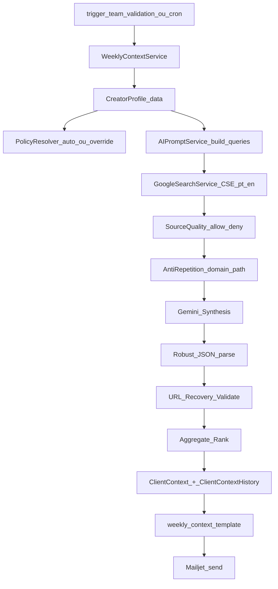

# Weekly Context (E-mail semanal) — Arquitetura Atual

> **Status:** Entregável atual (Weekly Context)  
> **Objetivo:** gerar e enviar semanalmente oportunidades com **links válidos**, **sem repetição** e **fonte controlada**.

Este documento descreve **o que está implementado hoje** (código + regras operacionais), sem conteúdo legado.

---

## 1) Fluxo end-to-end (real)



---

## 2) Componentes e arquivos (onde olhar)

- **Orquestração**: `ClientContext/services/weekly_context_service.py`
- **Prompt e queries**: `services/ai_prompt_service.py`
- **Busca Google (CSE)**: `services/google_search_service.py`
- **Qualidade de fontes**: `ClientContext/utils/source_quality.py`
- **Dedup de URL (domain+path)**: `ClientContext/utils/url_dedupe.py`
- **Policies + override**:
  - `ClientContext/utils/policy_registry.py`
  - `ClientContext/utils/policy_resolver.py`
  - `ClientContext/utils/policy_types.py`
  - `CreatorProfile.weekly_context_policy_override`
- **Template do e-mail**: `ClientContext/utils/weekly_context.py`
- **Script E2E**: `scripts/trigger_team_validation.py`
- **Propósito + UX (visão produto)**: `docs/WEEKLY_CONTEXT_PRODUCT.md`

---

## 3) Regras “hard” (não-negociáveis)

### 3.1 Anti-repetição semanal (domain+path)
- O sistema mantém histórico (tabela `ClientContextHistory`) e evita repetir links recentes.
- Dedupe também acontece dentro do mesmo e-mail (entre seções).

### 3.2 Qualidade de fontes (allowlist/denylist + padrões)
- Bloqueio por **domínio** (ex.: academic/repositórios/gating).
- Bloqueio por **padrões de URL** (ex.: `/tag/`, `/search`, `*.pdf`, downloads/listagens).
- Preferência por fontes allowlist por seção (mercado/tendências/concorrência etc.).

### 3.3 Links válidos (anti-404 e anti “URL alucinada”)
- Validação permissiva (não quebra por timeout/403), mas remove 404/soft-404 quando detectado.
- Recuperação de URL: tenta substituir URL gerada pela IA por URL real do Google Search quando houver mismatch.

### 3.4 Policy por cliente (auto + override manual)
- O resolver decide uma policy automaticamente com heurística simples.
- Se `weekly_context_policy_override` estiver preenchido e válido, ele tem precedência.
- Logs de auditoria: `[POLICY] key=... source=auto|override ...`

---

## 4) Observabilidade (logs que importam)

- `[POLICY]`: policy aplicada (auto/override) e parâmetros (idiomas/thresholds).
- `[SOURCE_AUDIT]`: volume raw por seção e domínios finais.
- `[SOURCE_METRICS]`: contagens (raw, denied, allow, selected, fallback).
- `[LOW_SOURCE_COVERAGE]`: quando uma seção crítica fica abaixo do mínimo.
- `[LOW_ALLOWLIST_RATIO]`: quando a proporção de allowlist cai abaixo do threshold.
- `[URL_DROPPED_404]`: quando link é descartado por 404.

---

## 5) Como validar (execução)

### Unit tests
```bash
cd PostNow-REST-API
venv/bin/python manage.py test ClientContext.tests -v 2
```

### E2E (envia email)
```bash
cd PostNow-REST-API
venv/bin/python scripts/trigger_team_validation.py
```

---

## 6) Pré-requisitos de execução (E2E)

### 6.1 Variáveis de ambiente mínimas

#### Google Custom Search (busca)
O serviço suporta múltiplos nomes de env var (legado/novo):
- `GOOGLE_SEARCH_API_KEY` **ou** `GOOGLE_CUSTOM_SEARCH_API_KEY`
- `GOOGLE_CSE_ID` **ou** `GOOGLE_CUSTOM_SEARCH_ENGINE_ID`

Parâmetros de qualidade (opcionais, mas recomendados):
- `GOOGLE_CSE_DATE_RESTRICT` (default: `w2`)
- `GOOGLE_CSE_GL` (default: `br`)
- `GOOGLE_CSE_LR` (default: vazio; o serviço também recebe `lr` via código, ex.: `lang_pt`/`lang_en`)

#### Gemini (síntese)
- `GEMINI_API_KEY`

#### Mailjet (envio de e-mail)
- `MJ_APIKEY_PUBLIC`
- `MJ_APIKEY_PRIVATE`
- `SENDER_EMAIL`
- `SENDER_NAME`
- (opcional) `ADMIN_EMAILS`

#### Dedup/lookback (opcional)
- `WEEKLY_CONTEXT_DEDUPE_WEEKS` (default: `4`)

### 6.2 Quando acontecer 429 no Google CSE (quota)
Às vezes a API retorna `429 Too Many Requests`. Isso significa **limite de quota/requests** do Google Custom Search.

Comportamento esperado:
- o pipeline pode reduzir cobertura de fontes em algumas seções
- mas **não deve quebrar** a execução inteira (o e-mail ainda deve ser enviado quando possível)

Mitigações recomendadas:
- **reduzir paginação**/volume de busca (menos páginas/starts)
- **rodar em horários de menor uso** (operação)
- **usar uma chave/CSE com quota maior** (operação)
- manter logs `[SOURCE_METRICS]` e `[LOW_SOURCE_COVERAGE]` para diagnosticar impacto

