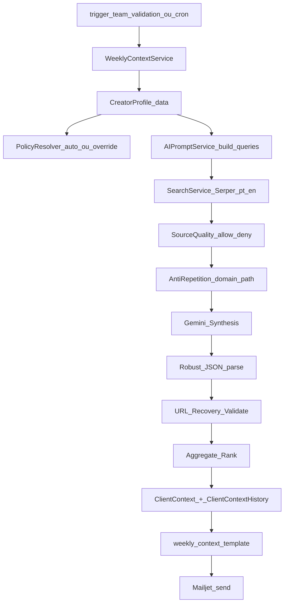

# Weekly Context (E-mail semanal) — Arquitetura Atual

> **Status:** Entregavel atual (Weekly Context)
> **Objetivo:** gerar e enviar semanalmente oportunidades com **links validos**, **sem repeticao** e **fonte controlada**.

Este documento descreve **o que esta implementado hoje** (codigo + regras operacionais), sem conteudo legado.

---

## 1) Fluxo end-to-end (real)


```mermaid
flowchart TD
  Trigger[trigger_team_validation_ou_cron] --> Service[WeeklyContextService]
  Service --> Profile[CreatorProfile_data]
  Profile --> Policy[PolicyResolver_auto_ou_override]
  Profile --> Queries[AIPromptService_build_queries]
  Queries --> Search[SearchService_Serper_pt_en]
  Search --> Quality[SourceQuality_allow_deny]
  Quality --> Dedupe[AntiRepetition_domain_path]
  Dedupe --> Synthesis[Gemini_Synthesis]
  Synthesis --> Parse[Robust_JSON_parse]
  Parse --> Recover[URL_Recovery_Validate]
  Recover --> Rank[Aggregate_Rank]
  Rank --> Persist[ClientContext_+_ClientContextHistory]
  Persist --> Email[weekly_context_template]
  Email --> Mailjet[Mailjet_send]
```

---

## 2) Componentes e arquivos (onde olhar)

- **Orquestracao**: `ClientContext/services/weekly_context_service.py`
- **Prompt e queries**: `services/ai_prompt_service.py`
- **Busca (Serper.dev)**: `services/search_service.py`
- **Descoberta de tendencias**: `services/trends_discovery_service.py`
- **Fetching e filtragem de fontes**: `ClientContext/services/source_fetching_service.py`
- **Qualidade de fontes**: `ClientContext/utils/source_quality.py`
- **Dedup de URL (domain+path)**: `ClientContext/utils/url_dedupe.py`
- **Policies + override**:
  - `ClientContext/utils/policy_registry.py`
  - `ClientContext/utils/policy_resolver.py`
  - `ClientContext/utils/policy_types.py`
  - `CreatorProfile.weekly_context_policy_override`
- **Templates de e-mail**:
  - `ClientContext/utils/email_templates.py`
  - `ClientContext/utils/html_formatters.py`
  - `ClientContext/utils/text_formatters.py`
- **Re-exports (backwards compat)**: `ClientContext/utils/weekly_context.py`
- **Script E2E**: `scripts/trigger_team_validation.py`
- **Proposito + UX (visao produto)**: `docs/WEEKLY_CONTEXT_PRODUCT.md`

---

## 3) Regras "hard" (nao-negociaveis)

### 3.1 Anti-repeticao semanal (domain+path)
- O sistema mantem historico (tabela `ClientContextHistory`) e evita repetir links recentes.
- Dedupe tambem acontece dentro do mesmo e-mail (entre secoes).

### 3.2 Qualidade de fontes (allowlist/denylist + padroes)
- Bloqueio por **dominio** (ex.: academic/repositorios/gating).
- Bloqueio por **padroes de URL** (ex.: `/tag/`, `/search`, `*.pdf`, downloads/listagens).
- Preferencia por fontes allowlist por secao (mercado/tendencias/concorrencia etc.).

### 3.3 Links validos (anti-404 e anti "URL alucinada")
- Validacao permissiva (nao quebra por timeout/403), mas remove 404/soft-404 quando detectado.
- Recuperacao de URL: tenta substituir URL gerada pela IA por URL real da busca quando houver mismatch.

### 3.4 Policy por cliente (auto + override manual)
- O resolver decide uma policy automaticamente com heuristica simples.
- Se `weekly_context_policy_override` estiver preenchido e valido, ele tem precedencia.
- Logs de auditoria: `[POLICY] key=... source=auto|override ...`

---

## 4) Observabilidade (logs que importam)

- `[POLICY]`: policy aplicada (auto/override) e parametros (idiomas/thresholds).
- `[SOURCE_AUDIT]`: volume raw por secao e dominios finais.
- `[SOURCE_METRICS]`: contagens (raw, denied, allow, selected, fallback).
- `[LOW_SOURCE_COVERAGE]`: quando uma secao critica fica abaixo do minimo.
- `[LOW_ALLOWLIST_RATIO]`: quando a proporcao de allowlist cai abaixo do threshold.
- `[URL_DROPPED_404]`: quando link e descartado por 404.

---

## 5) Como validar (execucao)

### Unit tests
```bash
cd PostNow-REST-API
venv/bin/python manage.py test ClientContext.tests -v 2
```

### E2E (envia email)
```bash
cd PostNow-REST-API
venv/bin/python scripts/trigger_team_validation.py
```

---

## 6) Pre-requisitos de execucao (E2E)

### 6.1 Variaveis de ambiente minimas

#### Serper.dev (busca)
- `SERPER_API_KEY`
- `SERPER_GL` (default: `br`)

#### Gemini (sintese)
- `GEMINI_API_KEY`

#### Mailjet (envio de e-mail)
- `MJ_APIKEY_PUBLIC`
- `MJ_APIKEY_PRIVATE`
- `SENDER_EMAIL`
- `SENDER_NAME`
- (opcional) `ADMIN_EMAILS`

#### Dedup/lookback (opcional)
- `WEEKLY_CONTEXT_DEDUPE_WEEKS` (default: `4`)

### 6.2 Quando acontecer erro na Serper API
A API pode retornar erros de rate limit ou quota.

Comportamento esperado:
- o pipeline pode reduzir cobertura de fontes em algumas secoes
- mas **nao deve quebrar** a execucao inteira (o e-mail ainda deve ser enviado quando possivel)

Mitigacoes recomendadas:
- manter logs `[SOURCE_METRICS]` e `[LOW_SOURCE_COVERAGE]` para diagnosticar impacto
- verificar quota em https://serper.dev/dashboard
